# Installation

The release version of PyTLidar can be installed as a standard python package

```
pip install PyTLidar
```


# TreeQSM

## TreeQSM Application Usage: GUI

To launch the GUI application run
```
python -m PyTLidar.main
```


The below interface will appear, with instructions for generating your QSM models.
You may choose to run a single file or multiple, with the ability to view the point cloud and results on the subsequent screen.


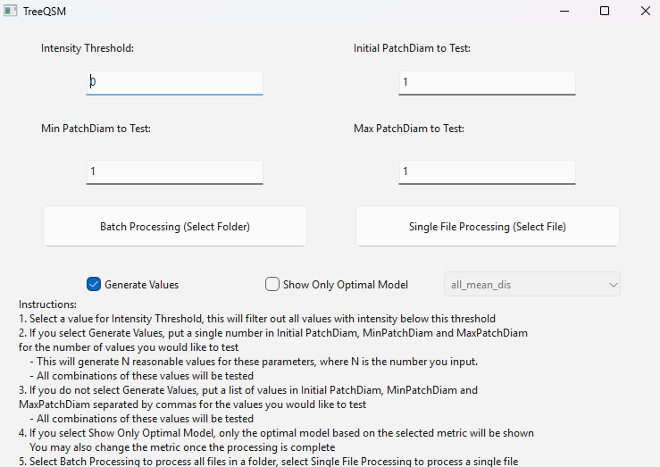

### Parameter Selection

If given an intensity threshold PyTLidar, will remove all points less than the given intensity. 

There are two options for Patch Diameter parameter selection: Automated and Custom. This option is selected using the "Generate Values" checkbox (Checked is automated, unchecked is custom.

For automated, you simply put the number of different values you'd like to test in the text box, then values will be calculated based on detected properties of the given point cloud. 
For custom, you must list the values you'd like to use separated by commas. You may list as many values as you'd like. 

For either parameter selection option, this will generate NxMxL runs where N, M, and L are the number of initial patch diameter, min patch diameter, and max patch diameter as each combination of values is tested. 

#### Recommendations

For your first time running a specific species and class, we recommend running first with the tool generating 3-4 values for each parameter. This will give you a good idea of a reasonable range for each parameter. These values will be provided on the next screen, and you can either run as is, or pick a smaller number of values within that range. 
After the run, evaluate each parameter for how well it fits your data. This can be done visually by looking at the various outputs and comparing how well the model matches to the point cloud and how reasonable the metrics are to your expectations. Alternatively, if you select show only optimal model, you can objectively evaluate how well each set of parameters fit based on the selected optimum metric.
You may change which metric to use after running in the display view as well.

Once you have an ideal set of parameters for that type of tree, we recommend maintaining those values for all trees in batch mode. This will help avoid unnecessary runs. 

If you have several classes of trees, a similar method can be used only using a subset of trees in batch mode. 

### Optimum

When selecting "Show Only Optimal", PyTLidar will display only the model with the set of parameters that give the best values (typically minimum) for the chosen optimum value. 
For example, if selecting "all_mean_dist", this will show the model (and selected parameters) that gives the lowest value for average distance between cylinder surface and points for all points. 
See more options in [optimum_metrics](optimum_metrics.md).

### Single File Navigation
When selecting Single file navigation, a window with the below control panel on the left side and the point cloud you are viewing on the right.
The top text in the control panel gives you meta data about your run, such as the parameters you provided or were calculated for you, and the file you selected.
The disabled navigation buttons will allow you to change what is displayed once the run is complete.
The text console will provide output and feedback of completion, etc.
Click "Start Processing" to begin the run.

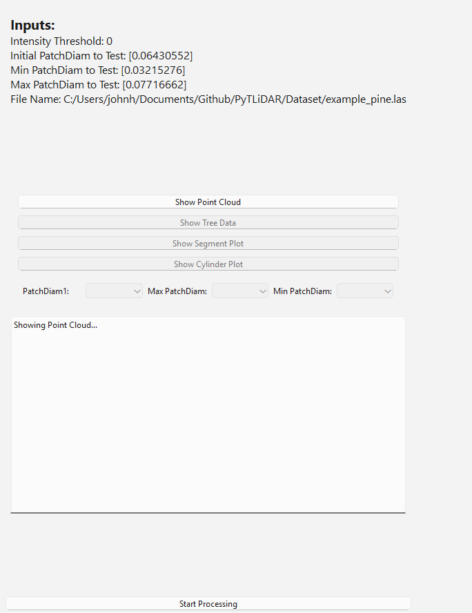

The point cloud that is displayed may be examined interactively by rotating (left click), zooming (scroll) and panning (right click). This view is available before the run completes.

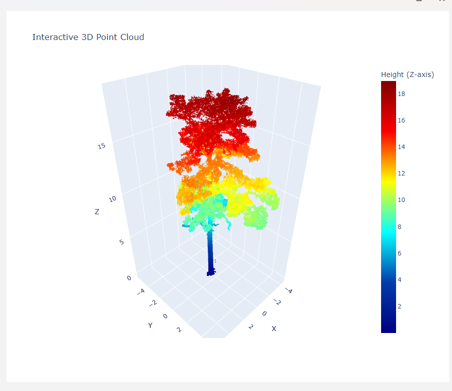

#### Display Options
Once the run is complete, you may select which model to show based on the below parameters. If "Show Only Optimal" was selected, you can change which optimum metric to use here. If it was not selected, you may select the patch diameter parameters for each model directly. 
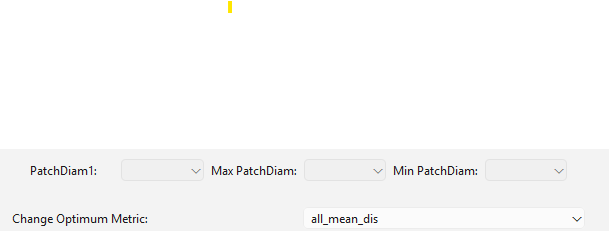

### Outputs
The below section gives an overview of each of the output screens available through selecting "Show Tree Data", "Show Segment Plot" and "Show Cylinder Plot"

#### Tree Data

When selecting tree data, a series of screens with various metrics will be displayed, which can be navigated utilizing the left and right arrows in the bottom right

##### Summary Stats
On the first screen, a plot of stem taper, various segment measurements by diameter class, and order class. 
Stem taper is the average diameter of the cylinders as a function of height. 
Volume, area, and length by diameter class is histogram of these values binned by diameter. Showing where most of the wood matter is as a function of diameter.
Volume, area, lenth, and number by branch order is a histogram of these values binned by branch order. Order is the hierarchical order of the branch (0th order is Trunk, 1st order is the primary branches, 2nd order is the children branches of the primary, and so on).
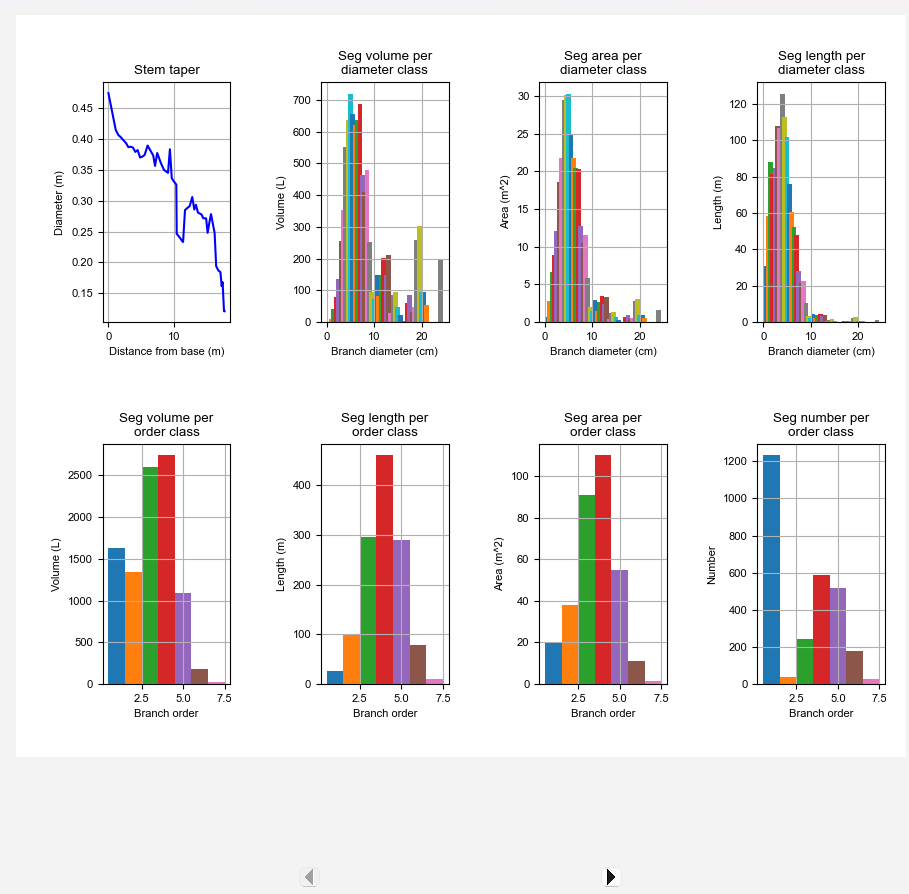
##### Height, Zenith, and Azimuth
This screen shows similar distributions based on segment height, zenith, and azimuth
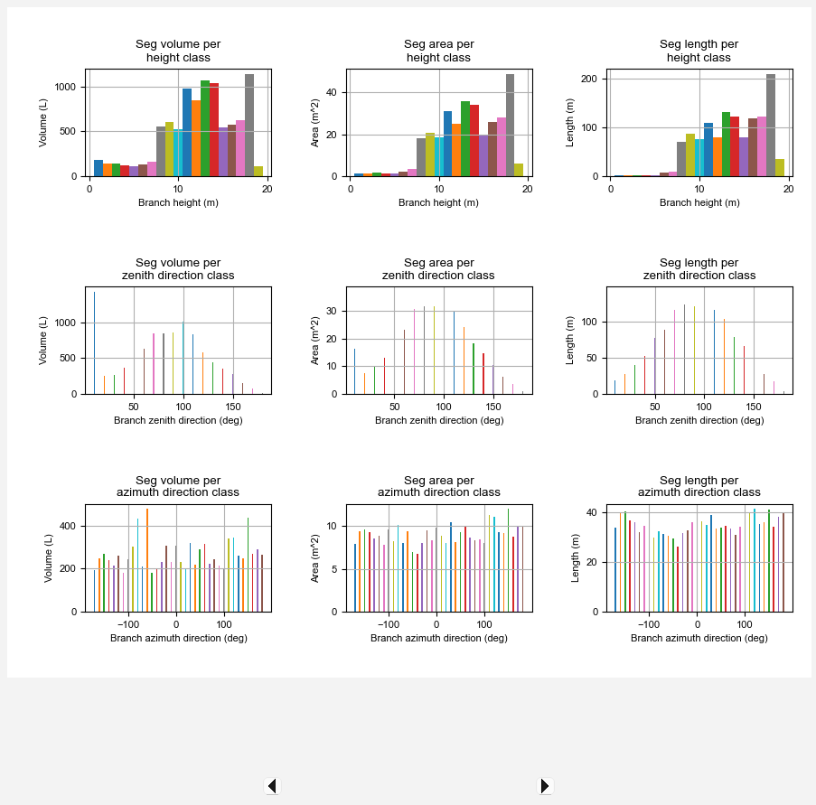
##### Relative Distributions: Diameter, Height, and Angle
This screen shows similar data as before, but shows the relative distribution instead of absolute measure. What this shows is what percentage of, for example, the volume is made up of branches of a certain measurement class. The blue bars represent all branches (including the trunk) and the orange bars represent only the first order (primary) branches. 
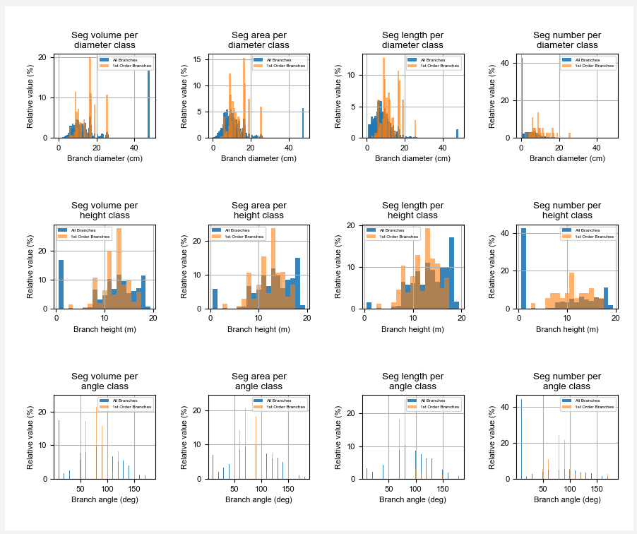
##### Relative Distributions: Zenith and Azimuth
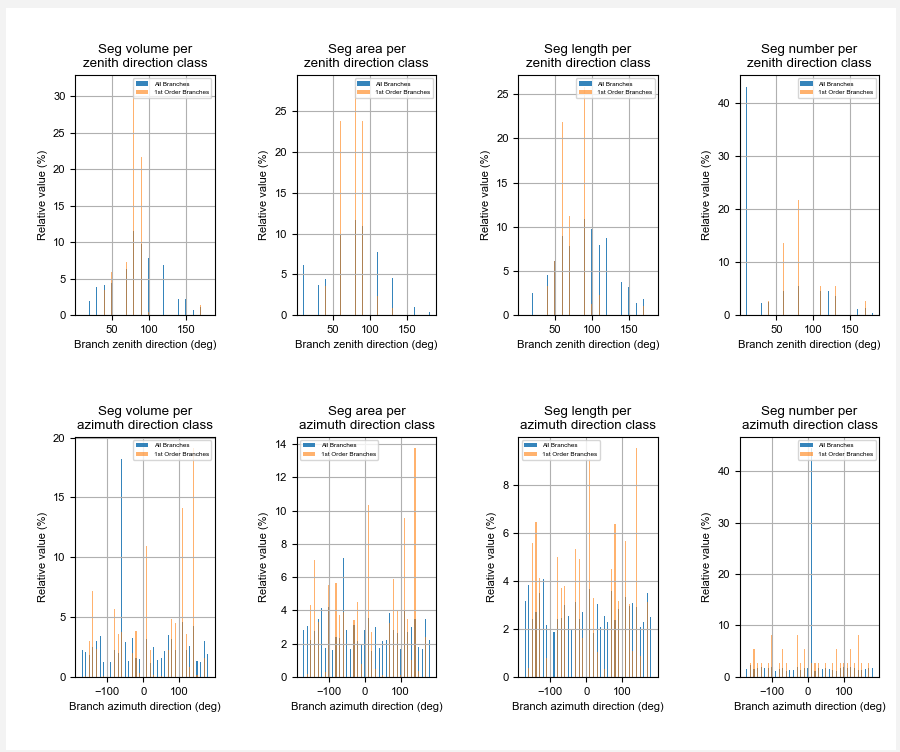

#### Segment Plot
The segment plot view allows the user to view what segments were found by the algorithm, as well as the initial uniform cover sets. This can be toggled using the provided buttons. 
This view can sometimes take a significant time to generate for larger files.
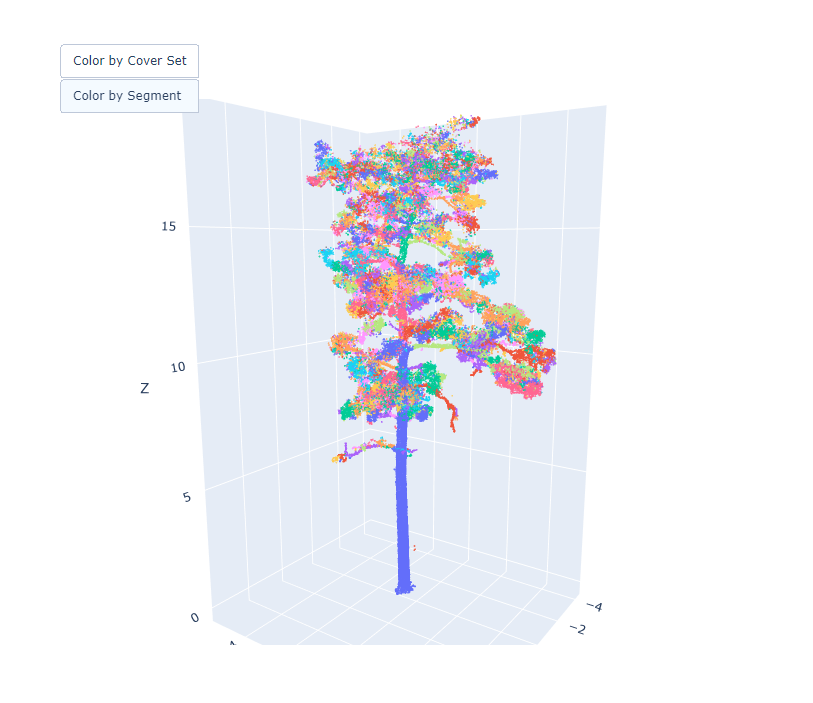

#### Cylinder Plot
The cylinder plot view allows the user to view the QSM that was generated by the tool. Note here that for memory-consumption reasons, branches below 10 cm in radius are represented as lines instead of solids. This can impact how well the scaled cylinders seem to fit the smaller branches visually.
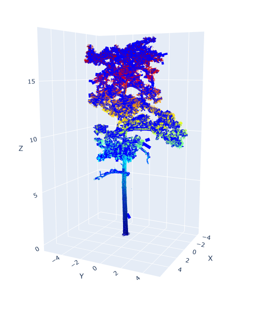

#### Saved Files
All files are saved in the /results folder as a child folder under the working directory where the tool was run. All files will be saved with this name \<output type>_\<Tree name>_\<Initial Patch Diameter>_\<Min Patch diam>_\<Max Patch Diam>.\<extension>. Where the various patch diameter values are the index if using generated values and the actual values if custom.
Tree data plots are saved as pdf with 0,1,2,3 appended to the end of the name and segment and cylinder plots are saved as html.
Tree data, branch and cylinder data is also saved in a txt file format.
Lastly, an .npz file containing the resulting run data is also generated for further manipulation in Python.

NOTE: files will be cleared when generating a new run, so move these files if you'd like to save them for later use. 
### Batch File Navigation
When running in batch mode, a very similar interface is displayed with some changes. 
In the top left, a table listing all files will display. As the runs are completed, data will be filled out here. If running using "Show Optimal Only" the patch diameters selected that optimize your selected metric will display here as well. 
You may change which file is displayed by clicking on the file name within this table. 

Additionally, you may control how to utilize parallel processing. By default, batch processing will run each file in parallel utilizing N cores where N = Min(Number of CPU Cores, Number of files). You may opt to run in series or limit the number of cores utilized through these options.
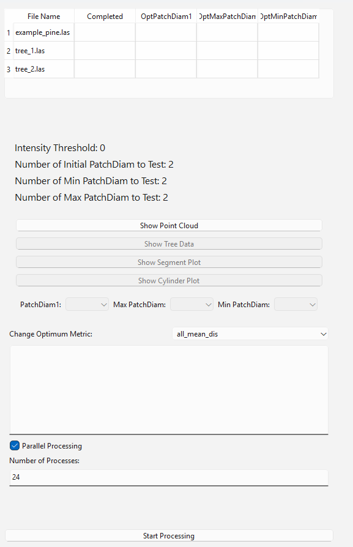

After completion, the table will be filled out and you can select which outputs to view the same as single file processing.
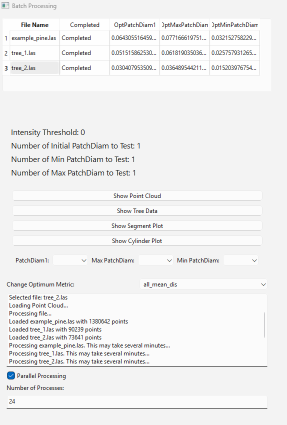

## TreeQSM Application Usage: CLI


We also provide multiple command line interface options using PyTLidar.treeqsm and PyTLidar.treeqsm_batch. This provides all the same functionality (and a few more options) as the GUI. 


You may run the following in your terminal

```
python -m PyTLidar.treeqsm file.las
```
or to run a full folder of las files in batch mode
```
python -m PyTLidar.treeqsm_batch folder
```
The below arguments can also be passed to provide full functionality 

    -intensity: filter point cloud based on values greater than the indicated intensity

    -normalize: recenter point cloud locations. Use this if your point cloud X, Y location values are very large (e.g., using UTM coordinates rather than a local coordinate system).

    -custominput: user sets specific patch diameters to test

    -ipd: initial patch diameter

    -minpd: min patch diameter

    -maxpd: maximum patch diameter

    -name: specifies a name for the current modeling run. This will be appended to the name generated by PyTLidar

    -outputdirectory: specifies the directory to put the "results" folder

    -numcores: specify number of cores to use to process files in parallel. Only valid in batched mode, Must be a single integer

    -optimum: specify an optimum metric to select best model to save (list of valid optimum values can be found in optimum_metrics.md

    -help: displays the run options

    -verbose: verbose mode, displays outputs from PyTLidar as it processes

    -h: displays the run options

    -v: verbose mode

The primary functions not available in the GUI but available here are -name, -outputdirectory, and -normalize.
The GUI selects a default name for the model to designate output files, using -name you can provide an additional organizing name.
The default location to place results is within the current working directory. If you'd like to place files somewhere else, or build this into a script and organize your files, you may use -outputdirectory.
The default behavior for the GUI is to normalize the input file to an average point value in order to minimize floating point error. If you need the original values to stay, or would like to manipulate them your own way prior to use in PyTLidar, you may eliminate this step by not including -normalize in your CLI arguments.
Examples:

1. Create a QSM for a single file, normalizing the file, and using 2 initial patch diameter values generated based on structural assumptions
```
python -m PyTLidar.treeqsm file.las --normalize --ipd 2
```
2.  Create a QSM for multiple files, with normalization, testing a specific set of patch diameter values, saving only the best model based on lowest mean distance to trunk
```
python -m PyTLidar.treeqsm_batch folder --normalize --custominput --ipd .05 .08 --minpd .03 .05 --maxpd .1 --optimum trunk_mean_dis
```

## TreeQSM Module Quick Start

The TreeQSM module can be used directly as well if you need more customization of the output data or direct connection to the objects. Further information on each of these functions' inputs and outputs can be found in [core_api.md](core_api.md).

Below is the algorithm sequence of the TreeQSM process on a single file and testing a single set of values. See treeqsm.py for a full implementation. This sequence must always be performed in this order, with very little room for change, but exposes all of the objects for use in your own pipelines.


The first steps of the process are to load your .las/.laz file. This should be a single tree with no/minimal non-tree points. If not already, these points should be normalized  around an average origin to minimize floating point precision errors often encountered using direct coordinates. You should then run define_input(). This will create the structure to input parameter to change and customize. You may also utilize it to auto-calculate the input parameters to run.

```
import PyTLidar.treeqsm as qsm


file = 'example_pine.las'

P = qsm.Utils.load_point_cloud(file) #Load las file

P = P - np.mean(P,axis = 0) #Normalize points

Inputs = define_input(P, 1, 1, 1)[0] #Create input parameter structure
```

If you'd like to customize the input parameters, the below are all customizable. All except 'plot' are parameters that will impact the actual ouput. 'plot' controls whether outputs will be auto-displayed or only saved for later.

```
# Inputs can be specified 
Inputs['PatchDiam1'] = [0.05] #Initial size of cover sets, lower values will capture more detail, but are more susceptible to occlusion
Inputs['PatchDiam2Min'] = [0.03] #Minimum cover set size for second pass
Inputs['PatchDiam2Max'] = [0.12] #Maximum cover set size for second pass
Inputs['BallRad1'] = [0.06] #radius around cover set midpoint to check for neighbors, should be slightly larger than PatchDiam1
Inputs['BallRad2'] = [0.13] #Ball Radius for second pass, should be slightly larger than PatchDiam2Max
Inputs['plot'] = 0 #Flag for plot generation during runtime
```

The core of the algorithm is the below sequence. This should only be modified if you have a solid understanding of the relationships between the objects created and modified by the functions. See [core_api.md](core_api.md) for more details.

```
cover1 = qsm.cover_sets(P,Inputs) #Generate initial cover sets and neighbors
cover1, Base, Forb = qsm.tree_sets(P, cover1, Inputs) #Tree set generation/detection of base points
segment1 = qsm.segments(cover1,Base,Forb) #Segment generation
segment1 = qsm.correct_segments(P,cover1,segment1,Inputs,0,1,1) #Segment Correction
RS = qsm.relative_size(P, cover1, segment1) #Calculation of relative size for generation of new cover sets
cover2 = qsm.cover_sets(P, Inputs, RS) # Cover set Generation, 2nd Pass
cover2, Base, Forb = qsm.tree_sets(P, cover2, Inputs, segment1) # Tree set generation
segment2 = qsm.segments(cover2, Base, Forb) #Segment Generation, 2nd Pass
segment2 = qsm.correct_segments(P, cover2, segment2, Inputs, 1, 1, 0)#Segment correction, 2nd Pass
cylinder = qsm.cylinders(P,cover2,segment2,Inputs) #Fit Cylinders
```

Once the qsm is built, data can be extracted using the below. This will give you the standard metrics delivered by the other methods.

```
branch = qsm.branches(cylinder)#Calculate branch metrics
#Extract Trunk points:
T = segment2['segments'][0]  
T = np.concatenate(T)  
T = np.concatenate([cover2['ball'][idx] for idx in T]) 
trunk = P[T, :]  # Point cloud of the trunk
treedata, _ = qsm.tree_data(cylinder, branch, trunk, inputs,iter )

```
# Tests

Run the tests using pytest:
```
pytest
```

This will run all the test cases under the tests/ directory. The tests include basic functionality checks for the core components of QSM creation.

You can also run specific tests by passing the test file or function name:

pytest tests/test_calculate.py

Due to the complex nature of inputs and outputs of the algorithm, manual tests are also recommended. Using Dataset/example_pine.las run:

```
python -m PyTLidar.treeqsm example_pine.las --normalize --verbose 
```

Compare the tree_data_Tree1_t1_m1.txt file that is generated to Dataset/results/example_pine_tree_data.txt. The algorithm is randomized, so many values will not match, but no value should be significantly different. 

This test can also be run using the GUI, and a visual check can also be done as a sanity check on the resulting numbers.


