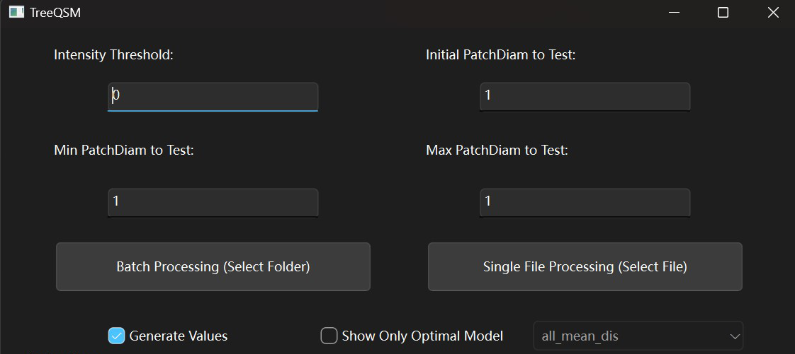

# PyTLidar

PyTLidar is a python module designed for manipulating and calculating metrics from terrestrial lidar data. Version 1 makes the TreeQSM[link] capabilites available through Python, eliminating the need for proprietary tools. Development of version 2.0 is in progress to enhance the capabilities with tree segmentation, calculation of digital elevation models, and detailed environmental measurements at scale.


# Installation

The release version of PyTLidar can be installed as a standard python package.

**Note**: Due to Open3d dependency. Python version must be between Python 3.8 and 3.11 (inclusive)

```
pip install PyTLidar
```
# Development Installation

If you are contributing to PyTLidar or would like to try one of the experimental packages, you may install following these instructions:

In your terminal navigate to the folder you want to clone this repo into and clone with 
```
git clone https://github.com/Landscape-CV/PyTLidar.git
cd PyTLidar
```
## Create a .venv & requirements installed
### Mac
```
python -m venv .venv
. .venv/bin/activate
pip install -r requirements.txt
```
### Windows
```
python -m venv .venv
. .venv/Scripts/activate
pip install -r requirements.txt
```

# TreeQSM

### TreeQSM Application Usage

Below is a quick start guide to using PyTLidar. For further detail, see [Docs](Docs)

To launch the GUI application run
```
python -m PyTLidar.main
```


The below interface will appear, with instructions for generating your QSM models.
You may choose to run a single file or multiple, with the ability to view the point cloud and results on the subsequent screen.





We also provide multiple command line interface options using PyTLidar.treeqsm and PyTLidar.treeqsm_batch

You may run the following your terminal

```
python -m PyTLidar.treeqsm file.las
```
or to run a full folder of las files in batch mode
```
python -m PyTLidar.treeqsm_batch folder
```
The below arguments can also be passed to provide full functionality 

    --threshold: filter point cloud based on values greater than the indicated intensity

    --normalize: recenter point cloud locations. Use this if your point cloud X, Y location values are very large (e.g., using UTM coordinates rather than a local coordinate system).

    --custominput: user sets specific patch diameters to test

    --ipd: initial patch diameter

    --minpd: min patch diameter

    --maxpd: maximum patch diameter

    --name: specifies a name for the current modeling run. This will be appended to the name generated by PyTLidar

    --outputdirectory: specifies the directory to put the "results" folder

    --numcores: specify number of cores to use to process files in parallel. Only valid in batched mode, Must be a single integer

    --optimum: specify an optimum metric to select best model to save 

    --help: displays the run options

    --verbose: verbose mode, displays outputs from PyTLidar as it processes

    -h: displays the run options

    -v: verbose mode

Examples:

1. Create a QSM for a single file, normalizing the file, and using 2 initial patch diameter values generated based on structural assumptions
```
python -m PyTLidar.treeqsm file.las --normalize --ipd 2
```
2.  Create a QSM for multiple files, with normalization, testing a specific set of patch diameter values, saving only the best model based on lowest mean distance to trunk
```
python -m PyTLidar.treeqsm_batch folder --normalize --custominput --ipd .05 .08 --minpd .03 .05 --maxpd .1 --optimum trunk_mean_dis
```

### TreeQSM Module Quick Start

The same steps the GUI and the command line run are available as functions, so a QSM can be
built from a script or a notebook:
```
from PyTLidar import load_cloud, centre, build_inputs, run_qsm

P = centre(load_cloud('example_pine.las'))          # Nx3 array, recentred the way the GUI does it
inputs = build_inputs(P, n_patchdiam=(1, 1, 1), names=['pine'], savepdf=0)[0]
models, cylinder_htmls = run_qsm(P, inputs)          # models[0]['cylinder'], models[0]['treedata'], ...
```
`build_inputs` can also take explicit values to test instead of generating them:
```
inputs = build_inputs(P, custom=([0.05], [0.03], [0.12]), names=['pine'])[0]
```
TreeQSM is randomised, so two runs on the same cloud give slightly different models. Use
`run_batch(clouds, inputs_list, n_workers)` to process several clouds in parallel worker
processes; call it from under `if __name__ == "__main__":` in a script. The individual
algorithm steps (`cover_sets`, `tree_sets`, `segments`, `cylinders`, ...) remain importable from
`PyTLidar.treeqsm` for anyone who wants to drive the pipeline by hand; see `treeqsm.py` for the
full sequence.
# Tests

Run the tests using pytest:
```
pytest
```

This will run all the test cases under the tests/ directory. The tests include basic functionality checks for the core components of QSM creation.

You can also run specific tests by passing the test file or function name:

pytest tests/test_calculate.py

Due to the complex nature of inputs and outputs of the algorithm, manual tests are also recommended. Using Dataset/example_pine.las run:

```
python -m PyTLidar.treeqsm example_pine.las --normalize --verbose 
```

Compare the tree_data_Tree1_t1_m1.txt file that is generated to Dataset/results/example_pine_tree_data.txt. The algorithm is randomized, so many values will not match, but no value should be significantly different. 

This test can also be run using the GUI, and a visual check can also be done as a sanity check on the resulting numbers.
# Under Development

Below are functionalities that are under active development to be included in future pip versions.
## Tree Segmentation

## Graph-Based Leaf Separation

## Region Growing Leaf Separation

## Ecomodel
Ecomodel is an experimental module intended to provide detailed metrics for complex environments

### Create a .env file
make a file in your parent director named `.env` and paste the following into it replace the ... with the filepath to your data
```
DATA_FOLDER_FILEPATH = ...
```
# Contributing
## Reporting Bugs

Submit a Report: You may submit your bug report to issues. Please include any relevant output.
Check to see if your issue has already been reported, commenting on the issue may help pinpoint the fix and also elevate the priority.

## Suggestions

Share your thoughts: You may submit your idea in issues as well. The more descriptive the better, but minor usability suggestions are welcome.

## Development

### Contributing Fixes

You may create a fork of our repository to submit a pull request. Your request will be reviewed and if approved will be incorporated. For best chances at approval, attach to an existing issue or create your own to resolve. 

### Contributing New Features

If you have a simple feature to add, you may follow the same procedure as contributing a fix. However, if you have a larger feature, collaboration with the broader team may be warranted. If you feel this is the case, please reach out to someone on the dev team and a plan can be developed for your collaboration and certain permissions may be granted. 

# License

PyTLidar is published under the GPL 3.0 License 
