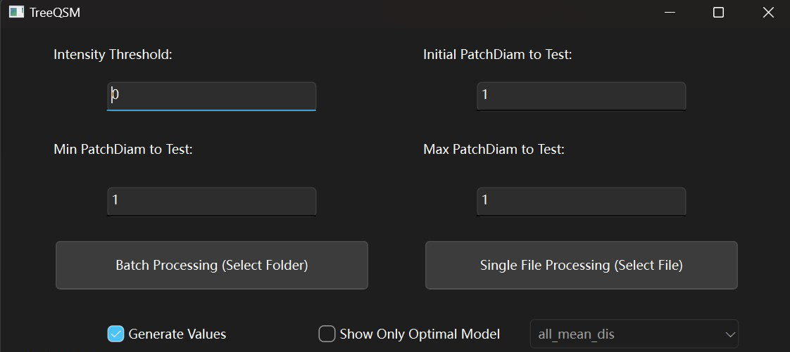
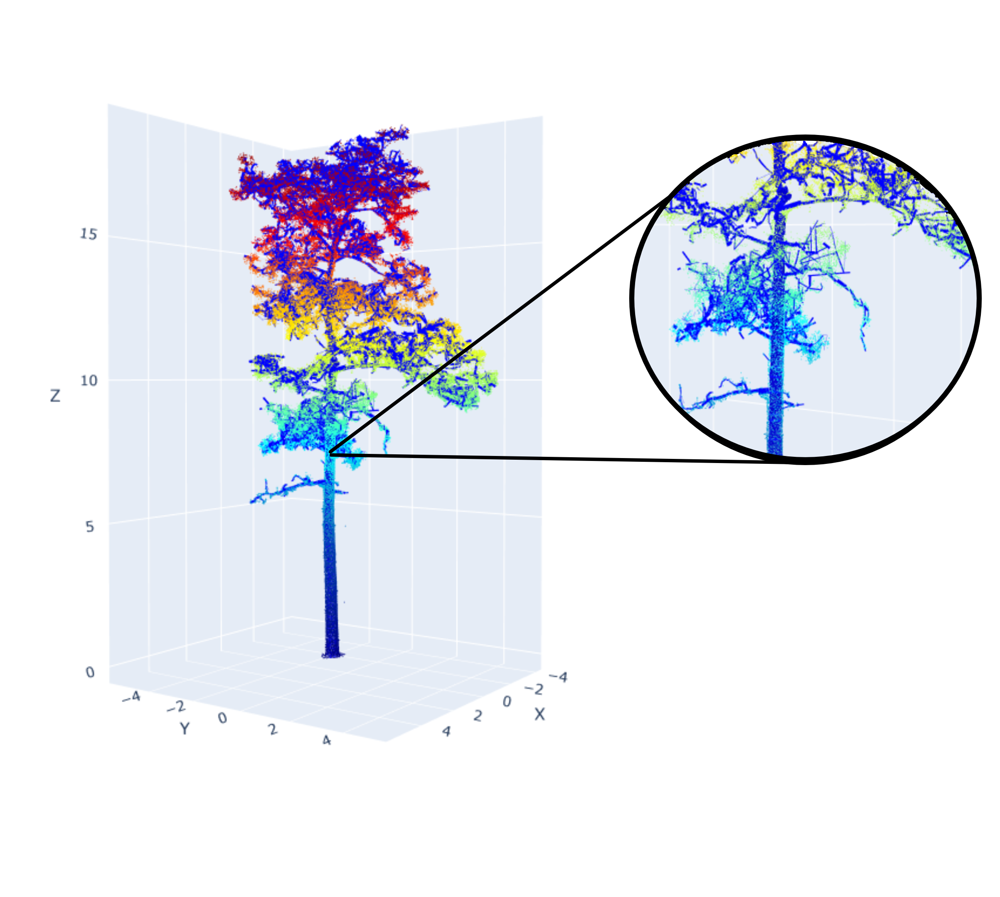

# Summary

[PyTLidar](https://github.com/Landscape-CV/PyTLiDAR) is an open-source Python package that reconstructs 3D tree Quantitative Structure Models (QSM) from Terrestrial Lidar Scanning (TLS) data, 
providing a user-friendly tool that improves and expands upon the MATLAB-based [TreeQSM](https://github.com/InverseTampere/TreeQSM?tab=readme-ov-file) method [@TreeQSM]. QSMs are used to automate detection and calculation of various topological and volumetric measurements that would normally take great effort to gather in the field. PyTLidar provides an accessible, extensible, and GUI-driven workflow for researchers and practitioners in forestry, ecology, and 3D vegetation modeling to create QSMs. The package also integrates interactive visualization tools for inspecting model quality and viewing calculated tree properties. The ease of use and installation of PyTLidar provides ecologists an option to gather forest measurements that does not rely on proprietary tools.

The key features of PyTLidar are a reproduction of the TreeQSM core functionality, and enhancing the experience of setting up experiments and viewing results. It provides functionality for loading and extracting point cloud data from .las and .laz files as well as automatic calculation of a range of initial parameters for the QSM model based on point cloud structure. The QSM creation methods include generation of a Voronoi partition of the point cloud, segment detection, detection of parent-child relationships of branches, and cylinder fitting. PyTLidar also calculates various tree metrics such as branch length and volume and provides these results in text format as well as visual graphics. QSMs are also output in an interactive format which can be viewed directly in the GUI as well as saved and shared as an html file. All of this is packaged within a user-friendly GUI while also providing support for command line and direct Python interfacing. 


# Statement of Need

Terrestrial Laser Scanning (TLS) is an active remote sensing technology which uses infrared laser pulses to collect millions of three-dimensional coordinate points on the surface of objects, 
preserving spatial information and providing unprecedented detail on structural information. The technology is rapidly being adopted for diverse uses in forestry and ecology, 
as it is useful for estimating forest structure [@rs13122297], aboveground biomass (AGB) [@https://doi.org/10.1002/ecs2.70232], canopy gap fraction and forest fuels [@fire6040151], crown shape [@10.1093/forestry/cpaa037], disturbance patterns [@cannon2024terrestrial], tree competition [@METZ2013275], physiology [@bg-12-1629-2015], and other ecological properties. 
To realize the potential of TLS for use in forestry and ecological applications, accurate and efficient reconstruction of QSMs from TLS point cloud data is essential [@f6114245].

The use of QSM software on point cloud data permits estimation of detailed components of branch architecture such as branch diameter, volume, and stem taper [@Lau2018],
providing detailed information for fine-scale estimates of AGB, canopy architecture, and more.
TreeQSM is a software that has been widely used in forestry and ecology for modeling tree structures from TLS point clouds [@TERRYN2020170]. 
Comparing to other similar softwares, TreeQSM stands out for speed, reliability, and ease of use, 
while [SimpleForest](https://www.simpleforest.org/) [@Hackenberg2021] (available within Computree) seems to be similarly capable to TreeQSM, but is only available through Computree, which has been undergoing an extended upgrade process and lacks up-to-date documentation. 
[AdQSM](https://github.com/GuangpengFan/AdQSM) [@Fan2020] is extremely fast and simple but lacks many of the statistics and visualizations other tools have and has not been officially released by the authors. 
[aRchi](https://github.com/umr-amap/aRchi) [@aRchi] provides various functions but takes significantly longer to create a QSM than comparable packages. 
[3dForest](https://github.com/VUKOZ-OEL/3d-forest-classic) [@3DForest] has a promising GUI but was unstable during testing, crashing when loading data. There is also a lack of viable options within Python specifically.
While TreeQSM is used in many applications, its reliance on MATLAB makes it less accessible for users, and its lack of graphical interface makes the tool less user-friendly and its parameter tuning less efficient. Thus we aimed to port and improve TreeQSM.

PyTLidar addresses these issues by providing a native Python implementation of TreeQSM’s core algorithms, 
wrapped in a streamlined graphical user interface that allows researchers to visualize and evaluate models. 
It promotes reproducible and exploratory research by offering transparent parameter control, open-source licensing, and seamless integration into Python-based analysis workflows. 
This work lowers the barrier for adoption of QSM modeling by removing the MATLAB dependency, enhancing accessibility for the broader open-source geospatial and ecological modeling community. PyTLidar is currently being used for ongoing projects in ecological monitoring and evolutionary field research. 


# Method

TreeQSM models individual trees from terrestrial lidar scans by first creating a Voronoi partition of the point cloud. This assigns the points within the cloud to an initial cluster based on its proximity to an initial point. The size of these regions, referred to as cover sets, are determined by the input patch diameters. Since the cover sets form the building blocks for reconstructing the tree’s global shape, the selection of the patch diameter can have a major impact on the quality of the resulting QSM. Larger patch diameters will connect points further away, counteracting occlusion, with a corresponding loss in detail. Conversely, smaller patch diameters will increase detail, but be more susceptible to occlusion. As part of the construction of the initial partition, the algorithm also determines the neighboring cover sets. Based on topological investigation of neighboring cover sets, the point cloud is segmented into individual branches, with parent-children relationships of branches identified. This process is repeated, re-creating the cover sets using a range of patch diameters based on location along the tree. Points determined to be along the trunk use size values closer to the max patch diameter, while points further up the tree use values closer to min patch diameter. After the second segment detection, each branch is approximated as a collection of connected cylinders of varying radius, length, and orientation. The cylinders are fit using standard root-finding methods to minimize distance between points and approximated cylinder surface. 
This cylinder-based representation offers a simple yet effective regularization of the complex tree structure, supporting downstream analyses such as stem volume estimation or structural trait extraction [@rs5020491,@rs70404581].


# Software Description

PyTLidar is organized into several key modules: core QSM algorithms (treeqsm.py), batch processing utilities (treeqsm_batch.py), GUI components built with [PyQt6](https://pypi.org/project/PyQt6/) (Python bindings for the Qt 6 framework), 
and visualization tools using Plotly. The software follows a modular design that allows researchers to either use the complete GUI application or integrate individual components into their own Python workflows. 

{ width=100% }

When using the GUI, users can input or automatically generate values for key modeling parameters, including the minimum, and maximum patch diameters within a user-defined parameter (Figure 2). Also, an intensity threshold can be set to filter the point cloud data, helping to remove lidar returns due to noise or vegetation prior to modeling. Users may choose between batch processing of an entire directory of point cloud files or processing a single file. The GUI also includes options for displaying only the optimal model, based on performance metrics such as mean point distance to constructed surface. 

 

{ width=80% }

After parameter and file selection, the software opens a new interface displaying data processing progress. 
Once the QSM reconstruction process is complete, PyTLidar provides interactive 3D visualization of the generated QSM using [plotly](https://plotly.com/) (Figure 3). 
Users can inspect the structural fidelity of the reconstructed model, including trunk and branch geometry, and compare different parameter configurations for best fit. 
This combination of visual feedback and customizable processing offers an efficient path toward accurate and transparent tree structure analysis. 
If running in batch mode, users may also set the number of parallel cores to utilize to run simultaneous processes.



Users can also review the morphological summaries of the QSM, including distribution of branch diameters, branch volume, surface area, and length with regard to diameter or order from stem, as with the original TreeQSM implementation (Figure 4). All of the produced figures are saved for later viewing and reference.

{ width=100% }

Both treeqsm.py and treeqsm_batch.py may be run directly from the command line. This allows users to integrate the same functionality provided in the GUI into their own scripts with ease, whether those scripts are in python or not. Python users can use the package directly and get the full functionality by importing treeqsm. 

# Availability and Installation

The latest development version of PyTLidar as well as usage instructions are available at this [GitHub repository](https://github.com/Landscape-CV/PyTLidar). The package requires Python 3.8+ and a few key dependencies listed in the requirements. 
Installation instructions and example datasets are provided in the repository documentation. The latest release version is available on PyPi and can be installed using ```pip install PyTLidar.```

# Future Additions

While the initial release is focused on porting only TreeQSM, several future additions to PyTLidar are planned. The first planned enhancement is to provide a novel pipeline for analyzing lidar scans of entire forest ecosystems to quantify vegetation structure at particular locations. 
This would allow users to load a series of lidar scan tiles and GPS observations of fauna and directly measure the environments, providing greater insights on components of habitat structural complexity. 

Other planned enhancements include functions provided to users for processing lidar point clouds, including but not limited to various methods to perform ground filtering, tree segmentation and leaf/wood separation. The intended goal for this package is to provide a single source for any user processing terrestrial lidar to perform every step of 
their analysis. 

# Acknowledgements

We acknowledge contributions and guidance during the development of the package from Dori Peters, Amir Hossein Alikhah Mishamandani and other staff from the Human-Augmented Analytics Group to make this happen.

# References
