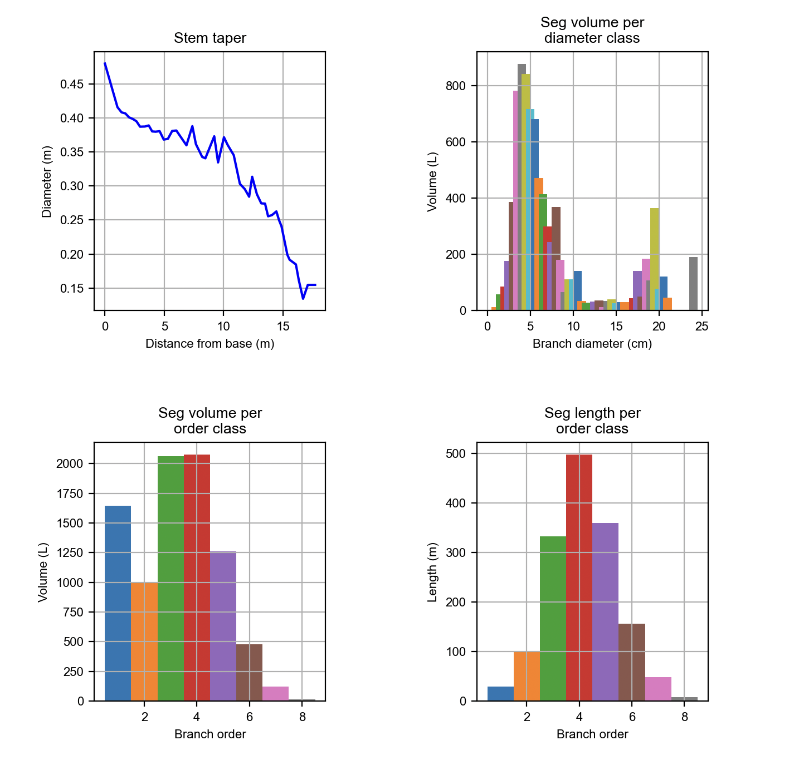

# Summary

[PyTLiDAR](https://github.com/Landscape-CV/PyTLiDAR) is an open-source Python package that reconstructs 3D tree Quantitative Structure Models (QSM) from Terresrial LiDAR Scan (TLS) data, 
providing a user-friendly tool improving and expanding based on the MATLAB-based [TreeQSM](https://github.com/InverseTampere/TreeQSM?tab=readme-ov-file) method [@TreeQSM]. 
PyTLiDAR provides an accessible, extensible, and GUI-driven workflow for researchers and practitioners in forestry, ecology, and 3D vegetation modeling. 
The package also integrates interactive visualization tools for inspecting model quality and derived tree metrics.

Key features of PyTLiDAR include:

-Loading and extracting point cloud data from las and laz files 

-Automatic calculation of a range of initial parameters for the QSM model based on point cloud structure 

-Generation of Voronoi partition (cover sets) of point cloud 

-Detection of segments through topological analysis of cover sets 

-Fitting of Cylinders 

-Calculation of Various Tree metrics including Branch length and volume, crown volume, and more 

-A user-friendly GUI  for batch or single-file processing 

-Support for interactive 3D visualization of tree models and parameter tuning 

-Batch data processing 

# Statement of Need

Terrestrial Laser Scanning (TLS) is an active remote sensing technology which uses infrared laser pulses to collect millions of points on the surface of objects, 
preserving spatial information and providing unprecedented detail on structural information. The technology is rapidly being adopted for diverse uses in forestry and ecology, 
as it is useful for estimating forest structure [@rs13122297], Above Ground Biomass (AGB) [@https://doi.org/10.1002/ecs2.70232], gap fraction and forest fuels [@fire6040151], crown shape [@10.1093/forestry/cpaa037], disturbance patterns [@cannon2024terrestrial], tree competition [@METZ2013275], physiology [@bg-12-1629-2015],and other ecological properties. 
To fully realize the potential of TLS for these applications, accurate and efficient reconstruction of QSMs from TLS point cloud data is essential [@f6114245].

The use of QSM software on point cloud data permits estimation of detailed components of branch architecture such as branch diameter, volume, and distribution along the trunk [@Lau2018],
providing detailed information for fine-scale estimates of AGB, canopy architecture, and more.
TreeQSM is a software that has been widely used in forestry and ecology for modeling tree structures from TLS point clouds [@TERRYN2020170]. 
Comparing to other similar softwares, TreeQSM stands out for speed, reliability, and ease of use, 
while [Computree](https://www.simpleforest.org/) offers broad functionality but suffers from a large installation size and less intuitive interface. 
[AdQSM](https://github.com/GuangpengFan/AdQSM) is extremely fast and simple but lacks advanced features and source code access. 
[aRchi](https://github.com/umr-amap/aRchi) provides various functions but is slow, not sufficiently documented, and harder to set up. 
[3dForest](https://github.com/VUKOZ-OEL/3d-forest-classic) has a promising GUI but is currently unstable, crashing when loading data. There is also a lack of viable options within Python specifically.
Thus, we would like to focus on porting and improving TreeQSM. Its reliance on MATLAB makes it less accessible for users without a commercial license or familiarity with the MATLAB environment. 
Furthermore, the lack of a graphical interface makes the tool less user-friendly and its parameter tuning less efficient.

PyTLiDAR addresses these issues by providing a native Python implementation of TreeQSM’s core algorithms, 
wrapped in a streamlined graphical interface that allows researchers to visualize and evaluate their models. 
It promotes reproducible and exploratory research by offering transparent parameter control, open-source licensing, and seamless integration into Python-based analysis workflows. 
This work lowers the barrier for adoption of QSM modeling by removing the MATLAB dependency, enhancing accessibility for the broader open-source geospatial and ecological modeling community. 

# Method

TreeQSM models individual trees from terrestrial LiDAR scans by covering the input point cloud with small, connected surface patche referred to as cover sets. 
These cover sets form the building blocks for reconstructing the tree’s global shape. The algorithm first identifies these cover sets using local geometric properties, 
then establishes neighbor relationships between adjacent cover sets. Based on topological investigation of neighboring surface cover sets, the point cloud is segmented into individual branches, 
with parent-children relationships of branches recorded. Then each branch is approximated as a collection of connected cylinders of varying radius, length, and orientation. The cylinders are fit using Newton's Method to minimize distance between points and approximated cylinder surface. 
This cylinder-based representation offers a simple yet effective regularization of the complex tree structure, supporting downstream analyses such as stem volume estimation or structural trait extraction [@rs5020491] [@rs70404581].

# Software Architecture

PyTLiDAR is organized into several key modules: core QSM algorithms (treeqsm.py), batch processing utilities (treeqsm_batch.py), GUI components built with [PyQt6](https://pypi.org/project/PyQt6/) (Python bindings for the Qt 6 framework), 
and visualization tools using Plotly. The software follows a modular design that allows researchers to either use the complete GUI application or integrate individual components into their own Python workflows. 
{ width=100% }

# Software Description

PyTLiDAR implements the TreeQSM model in Python, and uses PyQt6 (the Python implementation of Qt, a major GUI framework) to create an intuitive interface for parameter configuration and data processing. Upon launching the application, users can input or automatically generate values for key modeling parameters, including the minimum, and maximum patch diameters within a user-defined parameter (Figure 2). Also, an intensity threshold can be set to filter the point cloud data, helping to remove lidar returns due to noise or vegetation prior to modeling. Users may choose between batch processing of an entire directory of point cloud files or processing a single file. The GUI also includes options for displaying only the optimal model, based on performance metrics such as mean point distance to constructed surface. 

 

{ width=80% }

After parameter and file selection, the software opens a new interface displaying data processing progress. 
Once the QSM reconstruction process is complete, PyTLiDAR provides interactive 3D visualization of the generated QSM using [plotly](https://plotly.com/) (Figure 3). 
Users can inspect the structural fidelity of the reconstructed model, including trunk and branch geometry, and compare different parameter configurations for best fit. 
This combination of visual feedback and customizable processing offers an efficient path toward accurate and transparent tree structure analysis. 
If running in batch mode, users may also set the number of parallel cores to utilize to run simultaneous processes.

Users can also review the morphological summeries of the QSM, including distribution of branch diameters, branch volume, surface area, 
and length with regard to diameter or order from stem, as with the original TreeQSM implementation (Figure 4). All of the produced figures are also saved for later viewing and reference.

{ width=60% }

Both treeqsm.py and treeqsm_batch.py may be run directly from the command line. This allows users to integrate the same functionality provided in the GUI into their own scripts with ease, whether those scripts are in python or not. Python users can use the package directly and get the full functionality by importing treeqsm. 

# Availability and Installation

The latest development version of PyTLiDAR as well as usage instructions are available at this [GitHub repository](https://github.com/Landscape-CV/PyTLiDAR). The package requires Python 3.8+ and a few key dependencies listed in the requirements. 
Installation instructions and example datasets are provided in the repository documentation. The latest release version is available on PyPi using pip install PyTLiDAR.

# Future Additions

While the initial release is focused on porting only TreeQSM, several future additions to PyTLiDAR are planned. 

The first planned enhancement is to provide a novel pipeline for analyzing LiDAR scans of entire forest ecosystems to quantify vegetation structure at particular locations. 
This would allow users to load a series of LiDAR scan tiles and GPS observations of fauna and directly measure the environments, providing greater insights on components of habitat structural complexity. 

Other planned enhancements include functions provided to users for processing LiDAR point clouds, including but not limited to both established and novel methods to perform Ground 
Filtering, Tree Segmentation and Leaf/Wood separation. The intended goal for this package is to provide a single source for any user processing terrestrial LiDAR to perform every step of 
their analysis. 

# Acknowledgements

We acknowledge contributions from Amir Hossein Alikhah Mishamandani during the development of the package. This work also received high level guidance from Breanna Shi, Dori P., and thanks to
other staff from the Human-Augmented Analytics Group to make this happen.

# References
