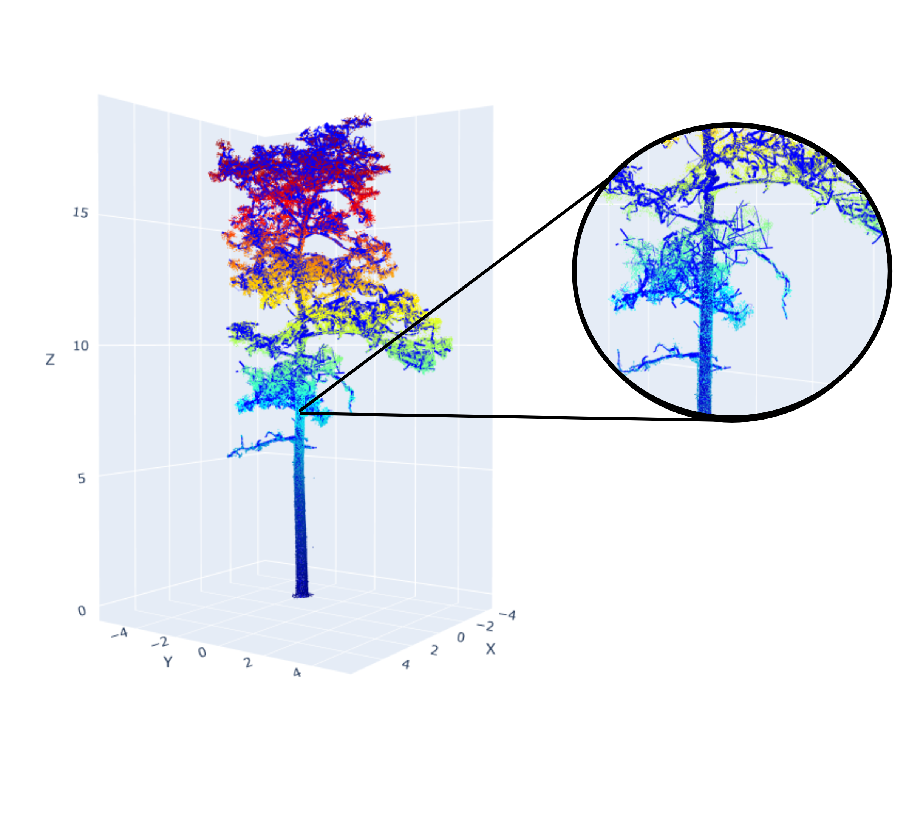

# Summary

[PyTLidar](https://github.com/Landscape-CV/PyTLiDAR) is an open-source Python package that reconstructs 3D tree Quantitative Structure Models (QSM) from Terrestrial Lidar Scanning (TLS) data, 
providing a user-friendly tool that improves and expands upon the MATLAB-based [TreeQSM](https://github.com/InverseTampere/TreeQSM?tab=readme-ov-file) method [@TreeQSM]. QSMs are used to automate detection and calculation of various topological and volumetric measurements that would normally take great effort to gather in the field. PyTLidar provides an accessible, extensible, and GUI-driven workflow for researchers and practitioners in forestry, ecology, and 3D vegetation modeling to create QSMs. The package also integrates interactive visualization tools for inspecting model quality and viewing calculated tree properties. The ease of use and installation of PyTLidar provides ecologists an option to gather forest measurements that does not rely on proprietary tools.

The key features of PyTLidar are a reproduction of the TreeQSM core functionality, and enhancing the experience of setting up experiments and viewing results. It provides functionality for loading and extracting point cloud data from .las and .laz files as well as automatic calculation of a range of initial parameters for the QSM model based on point cloud structure. The QSM creation methods include generation of a Voronoi partition of the point cloud, segment detection, detection of parent-child relationships of branches, and cylinder fitting. PyTLidar also calculates various tree metrics such as branch length and volume and provides these results in text format as well as visual graphics. PyTLidar is packaged within a user-friendly GUI while also providing support for command line and direct Python interfacing. 


# Statement of Need

Terrestrial Laser Scanning (TLS) is an active remote sensing technology which uses infrared laser pulses to collect millions of three-dimensional coordinate points on the surface of objects, 
preserving spatial information and providing unprecedented detail on structural information. The technology is rapidly being adopted for diverse uses in forestry and ecology, 
as it is useful for estimating forest structure [@rs13122297], aboveground biomass (AGB) [@https://doi.org/10.1002/ecs2.70232], canopy gap fraction and forest fuels [@fire6040151], crown shape [@10.1093/forestry/cpaa037], disturbance patterns [@cannon2024terrestrial], tree competition [@METZ2013275], physiology [@bg-12-1629-2015], and other ecological properties. 
To realize the potential of TLS for use in forestry and ecological applications, accurate and efficient reconstruction of QSMs from TLS point cloud data is essential [@f6114245].

The use of QSM software on point cloud data permits estimation of detailed components of branch architecture such as branch diameter, volume, and stem taper [@Lau2018],
providing detailed information for fine-scale estimates of AGB, canopy architecture, and more.
TreeQSM is a software that has been widely used in forestry and ecology for modeling tree structures from TLS point clouds [@TERRYN2020170]. 
While [SimpleForest](https://www.simpleforest.org/) [@Hackenberg2021] (available within Computree) seems to be similarly capable to TreeQSM, but is only available through Computree, which has been undergoing an extended upgrade process and lacks up-to-date documentation. 
[AdQSM](https://github.com/GuangpengFan/AdQSM) [@Fan2020] is extremely fast and simple but lacks many of the statistics and visualizations other tools have and has not been officially released by the authors. 
While TreeQSM is used in many applications, its reliance on MATLAB makes it less accessible for users, and its lack of graphical interface makes the tool less user-friendly and its parameter tuning less efficient.

PyTLidar addresses these issues by providing a native Python implementation of TreeQSM’s core algorithms, 
wrapped in a streamlined graphical user interface that allows researchers to visualize and evaluate models. 
It promotes reproducible and exploratory research by offering transparent parameter control, open-source licensing, and seamless integration into Python-based analysis workflows. 
This work lowers the barrier for adoption of QSM modeling by removing the MATLAB dependency, enhancing accessibility for the broader open-source geospatial and ecological modeling community. PyTLidar is currently being used for ongoing projects in ecological monitoring and evolutionary field research. While this is an initial release of just the QSM creation functionality, the intended goal for this package is to provide a single source for any user processing terrestrial lidar to perform every step of their analysis.


# Software Description

PyTLidar is organized into several key modules: core QSM algorithms (treeqsm.py), batch processing utilities (treeqsm_batch.py), GUI components built with [PyQt6](https://pypi.org/project/PyQt6/) (Python bindings for the Qt 6 framework), 
and visualization tools using Plotly. The software follows a modular design that allows researchers to either use the complete GUI application or integrate individual components into their own Python or command-line-based workflows. 

{ width=100% }

When using the GUI, users can input or automatically generate values for key modeling parameters and may choose between batch processing of an entire directory of point cloud files or processing a single file.
After parameter and file selection, the software opens a new interface displaying data processing progress. 
Once the QSM reconstruction process is complete, PyTLidar provides interactive 3D visualization of the generated QSM using [plotly](https://plotly.com/) (Figure 3). 
Users can inspect the structural fidelity of the reconstructed model, including trunk and branch geometry, and compare different parameter configurations for best fit. 
This combination of visual feedback and customizable processing offers an efficient path toward accurate and transparent tree structure analysis. 
If running in batch mode, users may also set the number of parallel cores to utilize to run simultaneous processes.



Users can also review the morphological summaries of the QSM, including distribution of branch diameters, branch volume, surface area, and length with regard to diameter or order from stem, as with the original TreeQSM implementation (Figure 4). All of the produced figures are saved for later viewing and reference.

{ width=100% }


# Availability and Installation

The latest development version of PyTLidar as well as usage instructions are available at this [GitHub repository](https://github.com/Landscape-CV/PyTLidar). The package requires Python 3.8-3.11 and a few key dependencies listed in the requirements. 
Installation instructions and example datasets are provided in the repository documentation. The latest release version is available on PyPi and can be installed using ```pip install PyTLidar.```


# Acknowledgements

We acknowledge contributions and guidance during the development of the package from Dori Peters, Amir Hossein Alikhah Mishamandani and other staff from the Human-Augmented Analytics Group to make this happen.
# References
